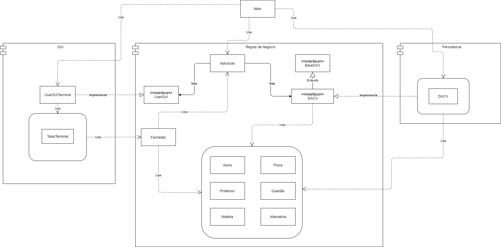

# SistemaDeProvas
Trabalho da matéria Engenharia de Software na UFMG

O objetivo desse trabalho é desenvolver um sistema simples onde um professor conseguirá cadastrar uma prova de múltipla escolha e, depois, os alunos respondem essa prova recebendo a sua nota. Além disso, o professor conseguirá ver a pontuação final de cada aluno.

O Sistema será desenvolvido na linguagem C++, terá uma interface no terminal e, como forma de persistência de dados, usaremos arquivos JSON.

Integrantes do grupo:
- Daniel Souza de Campos (Pendulun) (Frontend + Regras de Negócio)
- Felipe Machado Cordeiro (felipemcord) (Persistência)
- Letícia da Silva Macedo Alves (leticiasma) (Frontend)
- Marcos Vinícius de Carvalho Ribeiro (marcosmoade) (Regras de Negócio)

Quadro de tarefas:
https://github.com/Pendulun/SistemaDeProvas/projects/1

## Arquitetura Básica

## Fluxo Usuários

